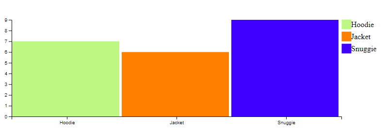

# Module 7. Data Visualization.
## Mandatory Task
## Barchart creation
### Rubén Carmona Pardo (*rubencpardo@gmail.com*)

The aim of this task is ot display a barchart starting from barchart refractor samples found on d3js samples repository.

Let's start showing an image of the final result and then it will be explained how to do it from the initial code.



Now, let's see step by step how it has been done:

**1) Original canvan**


Looking at this first barchart, there are many things to do to obtain a barchart similar to the first one.
* Adding space between columns.
* Adding colors to each band.
* Adding a legend.
* Showing the chart vertically.

**2) Showing the chart vertically**

This is the first change done to the original because if adding a legend or adding the space between column was the first step achieved, maybe when changing the chart orientation it would be necessary to redo it.

In order to do it, the actions must be taken in the following part of the original code:

```diff
function setupXScale()
{
  var maxSales = d3.max(totalSales, function(d, i) {
    return d.sales;
  });

  x = d3.scaleLinear()
    .range([0, width])
    .domain([0, maxSales]);

}

function setupYScale()
{
  y = d3.scaleBand()
    .rangeRound([0, height])
    .domain(totalSales.map(function(d, i) {
      return d.product;
    }));
}

function appendXAxis() {
  // Add the X Axis
  svg.append("g")
    .attr("transform",`translate(0, ${height})`)
    .call(d3.axisBottom(x));
}

function appendYAxis() {
  // Add the Y Axis
  svg.append("g")
  .call(d3.axisLeft(y));
}
```

Here, what you have to do is to change the data related to X and Y axis to the other. In X axis, despite of being a linear scale now it must be a band scale in order to insert every product name. And in the case of Y axis, it is now a linear scale with the maximum sales value. Also, in order to change the evolution of the sales values in the axis from the bottom to the top, its domain must be modified. 

**Solution**


**2) Adding color to each band**

In order to do it, firstly, it has been added to the data.js a new attribute called: 'color', related to every product.

Then, when appending the rects to the chart, it best be specified a new attribute about style to fill these rects with their color:

**Solution**

```diff
.style('fill', function(d, i) {
          return d.color
      });

```
**3) Adding space between columns**

Due to the fact that it has been defined X axis with scaleBand, when specifying the width of the band, you have to add the distance in which every band will be separated.

**Solution**
```dif

.attr('width', function(d, i) {
          return x.bandwidth() - 5;
      })

```